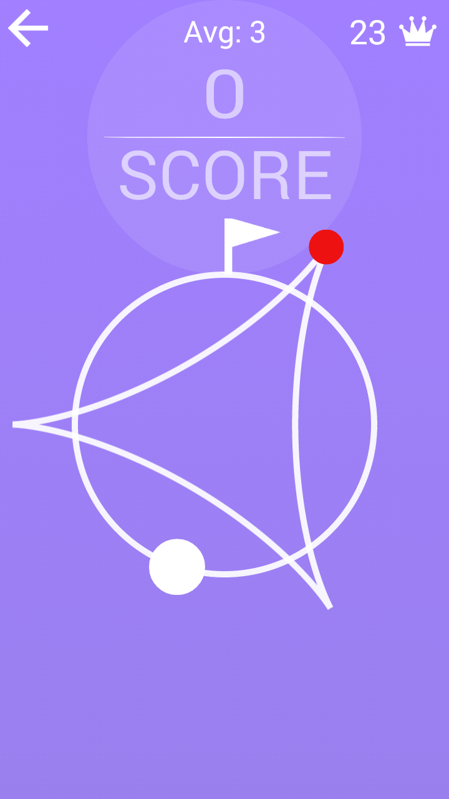
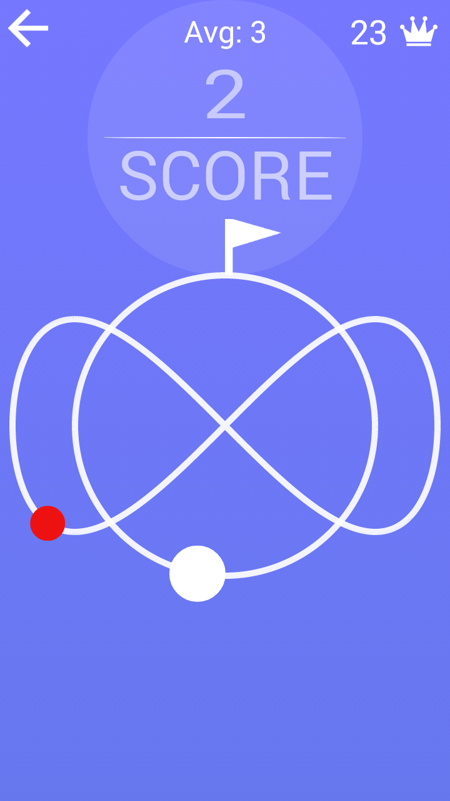
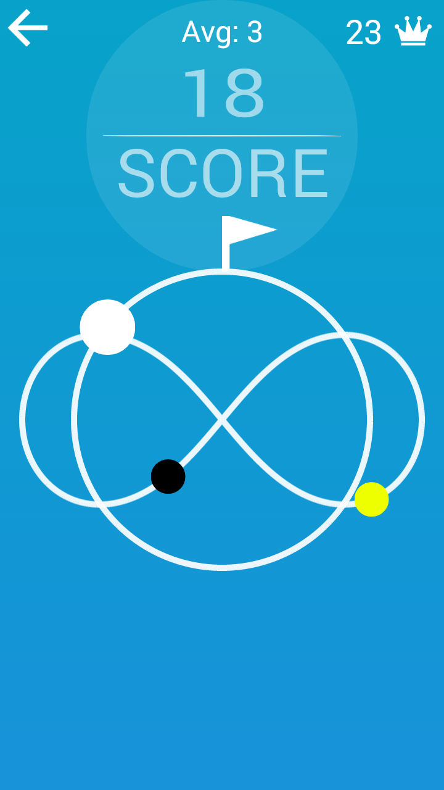
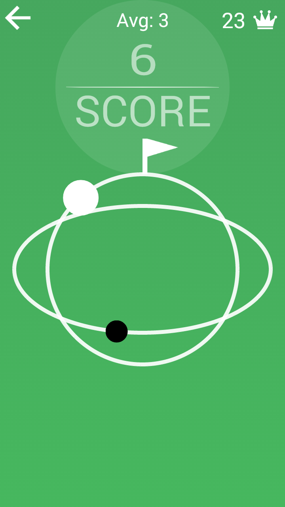
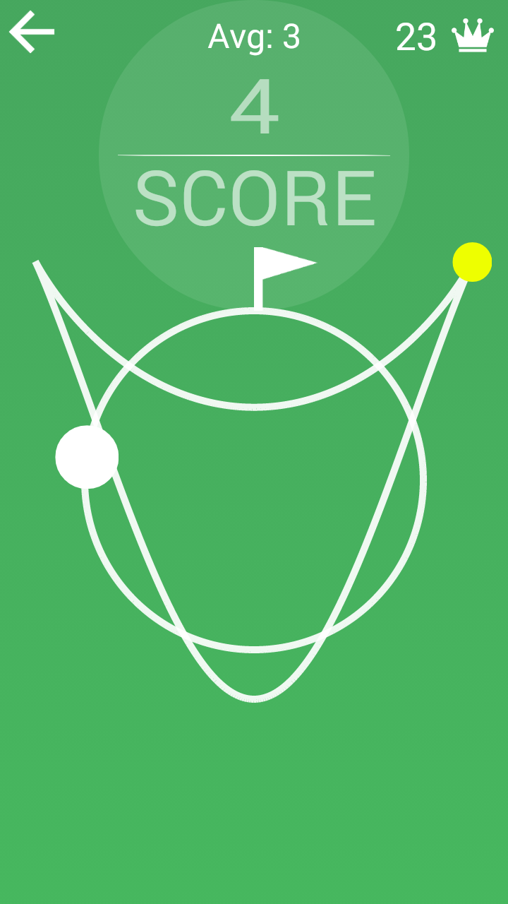
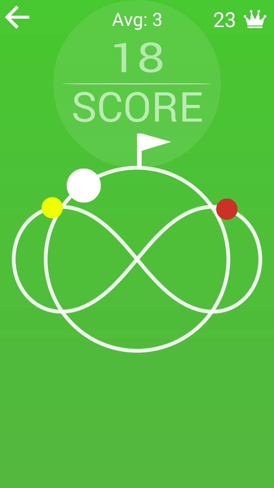

# Circle Run

#Screenshots:

This Repository Conntains the Solution to 'Circle Run' game developed by swastik &
published under publisher id-'Archer' on play store.

Link to the game on play store : 
https://play.google.com/store/apps/details?id=com.archer.circle_run

How To Play:
There is a white ball which revolves around a circular path and there are colored balls which revolve around a different curve.
You have to control the white ball to avoid collision with the colored ball.
You can control the speed of the white ball by touching/releasing the screen.
You die if you collide with the colored ball.
The number of colored balls increases with every lap the white ball completes.
Your aim is to make as many circles as possible.